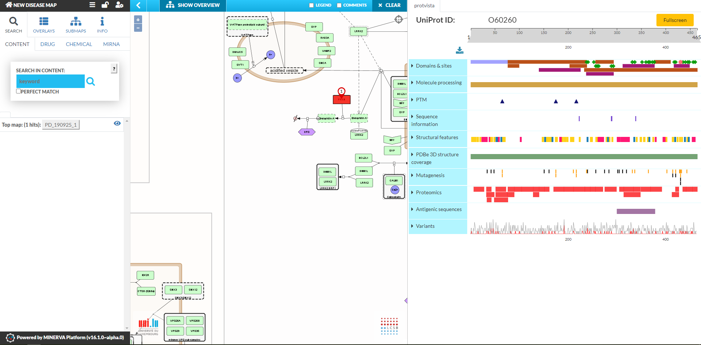

# Introduction

Research on human diseases often involves their molecular mechanisms, in an attempt to explain genetic risk factors, identify affected molecular pathways or propose plausible drugs. Number of bioinformatic resources catalog and encode different facets of this information. We need to combine these resources efficiently, and equip the researchers with visualisation tools to make the process of exploring and combining knowledge faster and more informative.

Our work focuses on visualisation of protein level annotations, from gene/protein annotation, 
protein-protein interaction, pathways and genomic variation. We integrate i) protein-level annotations of UniProt (https://uniprot.org) with an embedded browser of Disease Maps (disease-maps.org) and ii) the protein residue level information with Disease Maps ([Nightingale library](https://ebi-webcomponents.github.io/nightingale/#/)).

# An interface between UniProt and Disease Maps

UniProt is a widely recognised protein knowledge base, offering curated information about protein structure and function. Recently, UniProt started to develop disease-centric resources, like Alzheimer’s disease portal and COVID-19 platform (https://diseases.uniprot.org, https://covid-19.uniprot.org). These portals list and organise information about proteins related to a particular disease. 

In turn, Disease Maps (disease-maps.org) provide a standardised, diagrammatic way to encode mechanisms of human diseases (https://biohackrxiv.org/gmbjv/), with COVID-19 as a prime example (https://fairdomhub.org/projects/190). Disease Maps are manually curated, and [...]

We embeded diagrams visualised by MINERVA with corresponding protein-level visualisations. 

# A Nightingale plugin in the MINERVA Platform

We used the Nightingale library (https://ebi-webcomponents.github.io/nightingale/#/), a suite of standardised modular data visualisation components, 
including the protein feature annotation viewer ProtVista, a protein interaction visualisation and a 3D viewer Mol* (https://molstar.org). [...]

We defined standards for the data exchange for Nightingale components, to make them easily usable by other ELIXIR resources.

# Conclusions

