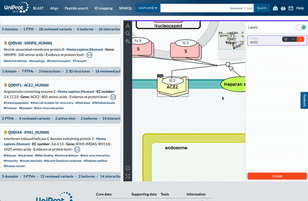
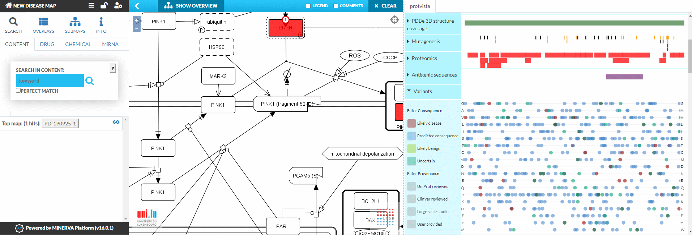
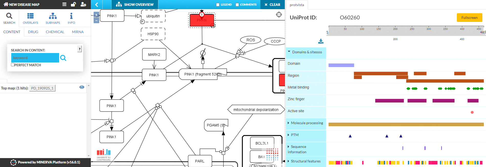
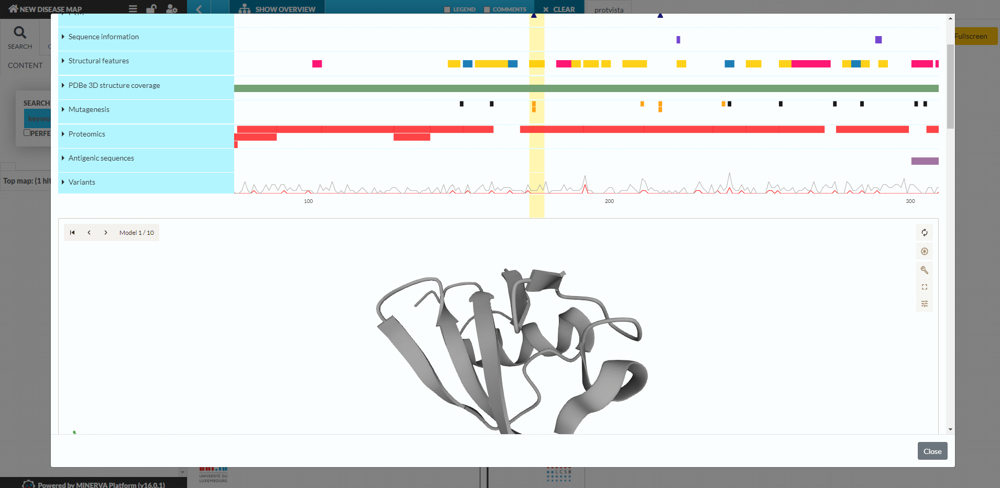

# Introduction

Research on human diseases often involves their molecular mechanisms, in an attempt to explain genetic risk factors, identify affected molecular pathways or propose plausible drugs. Number of bioinformatic resources catalog and encode different facets of this information. We need to combine these resources efficiently, and equip the researchers with interactive visualisation tools to make the process of exploring and combining knowledge faster and more informative.

Our work focuses on visualising protein level annotations, from gene/protein annotation, 
protein-protein interaction, pathways and genomic variation. We integrate i) protein-level annotations of UniProt (https://uniprot.org) with an embedded browser of Disease Maps (disease-maps.org) and ii) the protein residue level information with Disease Maps using the [Nightingale library](https://ebi-webcomponents.github.io/nightingale/#/).

We demonstrate the overall setup with both visualisation workflows on the COVID-19 Disease Map.
In particular, the list of UniProt entries related to COVID-19 can be shown side-by-side, allowing simultaneous exploration of both resources. Moreover, a dedicated plugin showing protein structures on the Map gives a detailed view into the structure of all annotated proteins.

# Results

## An interface between UniProt and Disease Maps

UniProt is a widely recognised protein knowledge base, offering curated information about protein structure and function. Recently, UniProt started to develop disease-centric resources, like Alzheimer’s disease portal and COVID-19 platform (https://diseases.uniprot.org, https://covid-19.uniprot.org). These portals list and organise information about proteins related to a particular disease. 

In turn, Disease Maps (disease-maps.org) provide a standardised, diagrammatic way to encode mechanisms of human diseases (https://biohackrxiv.org/gmbjv/), with COVID-19 as a prime example (https://fairdomhub.org/projects/190). Disease Maps are manually curated and rely on web-based platforms to explore them [@mazein_systems_2018]. One of them is the MINERVA Platform [@gawron_minerva-platform_2016], offering a range of exploration and visualisation functionalities. One of these functionalities is the recently developed widget (https://gitlab.lcsb.uni.lu/minerva/widget) allowing easy embedding of MINERVA-hosted maps.

We combined these two resources by extending the newly developed UniProt website (https://beta.uniprot.org) to embed the widget for the [COVID-19 Disease Map](https://covid19map.elixir-luxembourg.org/minerva/index.xhtml?id=covid19_map_BH21_v1). This way a dedicated COVID-19 collection of UniProt (https://covid-19.uniprot.org) is flanked by the diagrams of the Map (see Figure \ref{fig_upmw}). For better accessibility and reusability, the widget was published in the NPM repository (https://www.npmjs.com/package/@lcsb/minerva-widget).

The content of two resources is matched based on their UniProt identifiers. After harmonisation, 51 of identifiers (only human proteins) of the UniProt collection are still missing in the Map. The reason for this difference is that the curators of the Map diagrams did not find sufficient evidence for concrete molecular interactions linking these proteins to particular pathways. This can be resolved in subsequent steps by curation of the Map supported by bioinformatic workflows like text mining and network analysis [@ostaszewski_covid19map_2021].

The integration of these resources is interactive. The selection of a protein entity in the widget triggers the highlight of the corresponding UniProt entry, allowing further exploration of the annotation. Likewise, the selection of a protein card in UniProt triggers a search in the MINERVA widget, highlighting the corresponding entities on the Disease Map.

## A Nightingale plugin in the MINERVA Platform

We used the Nightingale library (https://ebi-webcomponents.github.io/nightingale/#/), a suite of standardised modular data visualisation components, including the protein feature annotation viewer ProtVista [@watkins_protvista_2017] and a protein interaction visualisation and a 3D viewer Mol* (https://molstar.org). Nightingale was incorporated into the MINERVA platfrom as a plugin, following a previously defined architecture [@hoksza_closing_2020] (see Figures \ref{fig_nmp1}, \ref{fig_nmp2} and \ref{fig_nmp3}).

The Nightingale plugin relies on the UniProt identifiers in the Map for which it is loaded (code available https://gitlab.lcsb.uni.lu/minerva/plugins/protvista). It displays the set of annotations interactively, extending the content of a given Map. Moreover, the plugin allows to incorporate user-provided genetic variant overlays into the Nightingale visualisation, for variants where information on amino-acid change is provided.

# Conclusions

We have harmonised protein and pathway-level visualisation tools, allowing faster and more effcient exploration and interpretation of disease-related molecular mechanisms. 

First, we enabled side-to-side browsing of UniProt and Disease Maps contents. Bringing together detailed protein annotations and showing the pathway context for these proteins at the same time.

By setting up the Nightingale MINERVA plugin, we extended the support of the library to the Disease Maps. Moreover, we identified gaps in the data exchange interfaces of the Nightingale components. Addressing these will improve their usability by other ELIXIR resources.

Finally, the use-case of COVID-19 allowed us to identify gaps in the COVID-19 Disease Map, and to prepare a dedicated build with enriched annotation of the Map.

# Bibliography